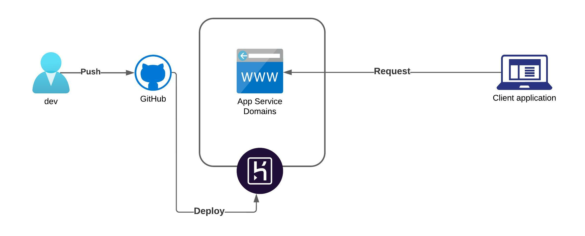

#  Challenge MeLi 

El challenge consiste en desarrollar una api que devuelva la frecuencia de una palabra, dado 1 o varios archivos de texto

## Prerrequisitos  

- Navegador web
- Postman

## Arquitectura

## Datos de la Infraestructura

* Heroku
* Github

* Paquetes
  * Python3
  * Flask
  * Gunicorn

* Archivos .txt
 * Branch: master - meli/coleccion_2022/

## Archivos de implementación

### [main.py](https://github.com/lcastineiras/meli/blob/49cc1c3bda1d59b883b3d4e433a3065e142d0086/main.py)

 * En este archivo se encuentra el código para hacer el despliegue de la api.
 
### [funcion.py]

* En este archivo se encuentra el codigo de las funciones que utilizará el main.py.

### [Procfile](https://github.com/lcastineiras/meli/blob/49cc1c3bda1d59b883b3d4e433a3065e142d0086/Procfile)

* En este archivo se detallan los comandos que ejecuta la aplicación en Heroku.

### [requirements.txt](https://github.com/lcastineiras/meli/blob/49cc1c3bda1d59b883b3d4e433a3065e142d0086/requirements.txt)

* En este archivo se detalla los paquetes que se precisan instalar en el servidor en el que va a correr la api.

### [coleccion_2022](/coleccion_2022/)

* Esta carpeta contiene los archivos .txt a ser analisados.

