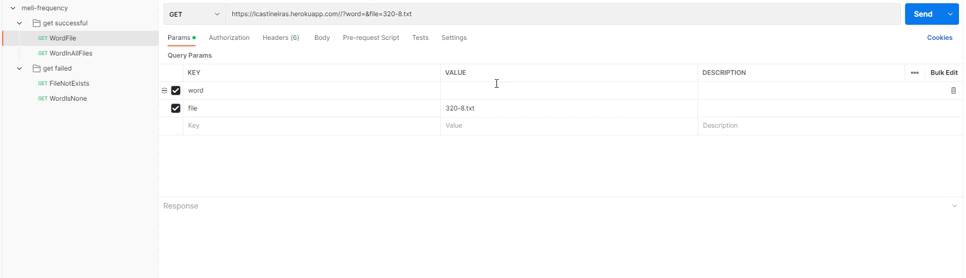

#  Challenge MeLi 

**Índice**

1. [Objetivo](#id1)
2. [URL API](#id2)
3. [Colección de pruebas](#id3)
4. [Prerrequisitos](#id4)
5. [Arquitectura](#id5)
6. [Datos de la Infraestructura ](#id6)
7. [Archivos de implementación](#id7)

## Objetivo 
El challenge consiste en desarrollar una api que devuelva la frecuencia de una palabra, dado 1 o varios archivos de texto.

La API fue desarrollada en Python, utilizando Flask como framework para el despliegue de la aplicación web.
Uno de los objetivos de este challenge es disponibilizar la api "0 touch" por lo que se utilizó la herramienta Heroku para cumplir este requerimiento.

La URL para poder realizar los request es la siguiente: 
  * https://lcastineiras.herokuapp.com

## Colección de pruebas 
  
En el repositorio se encuentra una colección de [Postman](https://github.com/lcastineiras/meli/blob/9ceccb7cf7ca74c91bcaac04c3c08e09d8d1360c/Docs/meli-frequency.postman_collection.json) con las distintas casuísticas de los request.

## Prerrequisitos  

- Navegador web
- Postman

## Arquitectura 

## Datos de la Infraestructura 

* Heroku
* Github

* Paquetes
  * Python3
  * Flask
  * Gunicorn

* Archivos .txt
 * Branch: master - meli/coleccion_2022/

## Archivos de implementación 

### [Main.py](https://github.com/lcastineiras/meli/blob/49cc1c3bda1d59b883b3d4e433a3065e142d0086/main.py)

 * En este archivo se encuentra el código para hacer el despliegue de la api.
 
### [Funcion.py](https://github.com/lcastineiras/meli/blob/dedd6476baa82d59c2997b1313573b47092eac93/funcion.py)

* En este archivo se encuentra el codigo de las funciones que utilizará el main.py.

### [Procfile](https://github.com/lcastineiras/meli/blob/49cc1c3bda1d59b883b3d4e433a3065e142d0086/Procfile)

* En este archivo se detallan los comandos que ejecuta la aplicación en Heroku.

### [Requirements.txt](https://github.com/lcastineiras/meli/blob/49cc1c3bda1d59b883b3d4e433a3065e142d0086/requirements.txt)

* En este archivo se detalla los paquetes que se precisan instalar en el servidor en el que va a correr la api.

### [Coleccion_2022](https://github.com/lcastineiras/meli/tree/49cc1c3bda1d59b883b3d4e433a3065e142d0086/coleccion_2022)

* Esta carpeta contiene los archivos .txt a ser analizados.

__Autores__ :muscle:

> Lucía Castiñeiras
